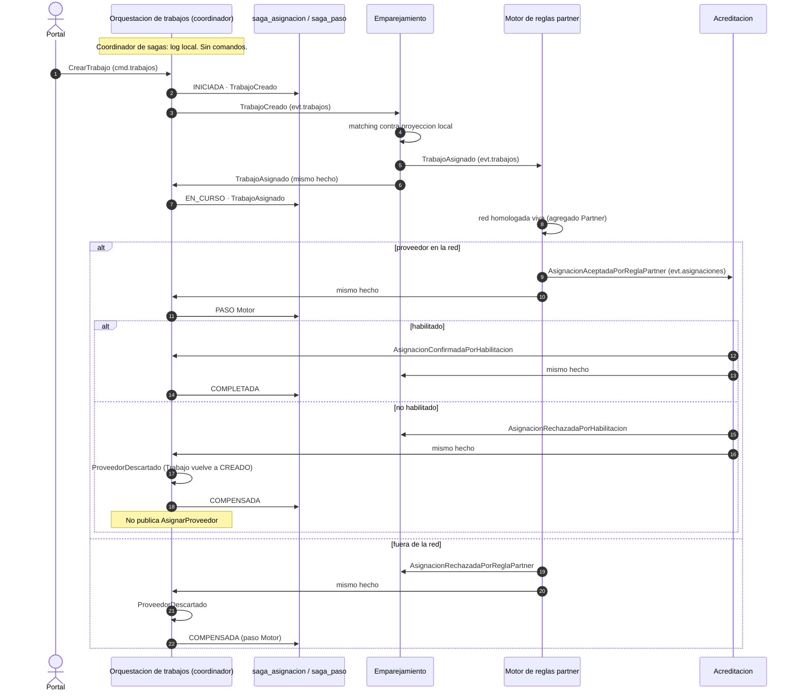
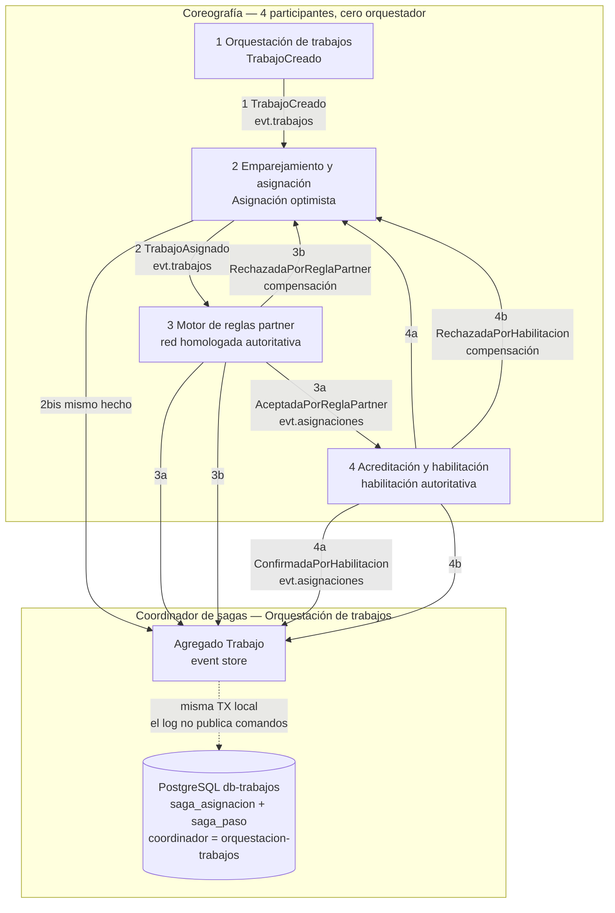

# Entrega 5 — Saga de asignación (coreografía)

Alcance recortado: almacenamiento y transacciones. No hay BFF, ni colección
Postman nueva, ni experimentos cuantitativos, ni refinamiento del mapa TO-BE.

La transacción larga es **asignar un proveedor habilitado y homologado a un
trabajo ya aceptado**. Cruza **cuatro** bounded contexts. Nadie dirige el
flujo: cada servicio reacciona a un evento y publica el siguiente hecho.

**Coordinador de sagas:** Orquestación de trabajos. Dueño de `trabajo_id`,
del event store de `Trabajo` y de las tablas `saga_asignacion` / `saga_paso`.
El log no es un quinto microservicio. El campo `coordinador` vale
`orquestacion-trabajos`.

## Diagrama (lo que muestra el tutor)

Imagen renderizada: `docs/entrega5/arquitectura-saga.png` (también `.svg`).



Topología de los cuatro participantes y del log (el coordinador no manda el siguiente paso):



Camino feliz:

```
CrearTrabajo
  → TrabajoCreado                         (Orquestación)
  → TrabajoAsignado                       (Emparejamiento)
  → AsignacionAceptadaPorReglaPartner     (Motor)
  → AsignacionConfirmadaPorHabilitacion   (Acreditación)
estado saga: INICIADA → EN_CURSO → COMPLETADA
pasos en el log: los cuatro service_name
```

Camino de compensación (proyección de emparejamiento desfasada respecto del
dato autoritativo de habilitación). Motor ya aceptó la red homologada:

```
TrabajoAsignado (optimista)
    → AsignacionAceptadaPorReglaPartner
    → AsignacionRechazadaPorHabilitacion
    → Emparejamiento marca RECHAZADO
    → Orquestación aplica ProveedorDescartado: Trabajo vuelve a CREADO
estado saga: EN_CURSO → COMPENSADA
```

Otra compensación, misma coreografía: Motor rechaza porque el proveedor no
está en la red homologada viva (`AsignacionRechazadaPorReglaPartner`).
Acreditación no llega a correr. Orquestación **no** publica `AsignarProveedor`:
ese comando no tiene consumidor y convertiría al coordinador en orquestador.

## Dónde vive el saga log, y por qué

Se **adjunta a Orquestación de trabajos**, que es el **coordinador de sagas**,
en las tablas `saga_asignacion` y `saga_paso` de `db-trabajos`. No es un quinto
microservicio.

| Opción | A favor | En contra |
|---|---|---|
| Servicio dedicado `saga-log` | Observador puro, DB aparte | Quinto contenedor, quinto Postgres, sin agregado. En un diagrama se confunde con un orquestador. |
| Adjuntarlo a Emparejamiento | Ve la asignación | No ve `TrabajoCreado` resuelto ni el event store del trabajo. |
| Adjuntarlo a Acreditación | Ve el veredicto de habilitación | No ve el inicio ni el paso de Motor. |
| Adjuntarlo a Motor | Ve la red homologada | No ve el inicio ni el cierre de habilitación. |
| **Adjuntarlo a Orquestación (coordinador)** | El id de la saga **es** `trabajo_id`. Este servicio ya produce o consume los hitos de los cuatro. El log se escribe en la **misma transacción local** que el event store. | Mezcla una proyección operativa con el dueño de `Trabajo`. Se mitiga dejando el log como módulo de persistencia, sin comandos de salida. |

El log **no publica**. Si empezara a mandar `AsignarProveedor` dejaría de ser
coreografía. Ese comando queda fuera de la saga: Emparejamiento no lo consume.

## DDD solo donde corresponde

| Contexto | Agregado | Lo que aporta a la saga |
|---|---|---|
| Orquestación de trabajos | `Trabajo` | Acepta el trabajo, congela el SLA, deshace `ASIGNADO` al compensar. **Coordinador de sagas** (log). |
| Emparejamiento | `Asignacion` | Asigna contra proyección local; `CONFIRMADO` o `RECHAZADO`. |
| Motor de reglas partner | `Partner` | Dato autoritativo de la red homologada. Confirma o dispara compensación. |
| Acreditación | `Proveedor` | Dato autoritativo de habilitación. Confirma o dispara compensación. |

No se inventó un agregado "Saga". El log es infraestructura de monitoreo, no
un bounded context nuevo. Motor **sí** participa: Emparejamiento usa una
proyección que puede estar desfasada; Motor habla con la regla viva.

## Cómo verlo con SQL

Con el stack arriba, `./scripts/demo_saga.sh` deja dos sagas. Después:

```bash
docker exec -it db-trabajos psql -U trabajos -d trabajos -f /dev/stdin < scripts/consulta_saga.sql
```

Consultas sueltas en `scripts/consulta_saga.sql`. HTTP de operador, no BFF:

```bash
curl -sS http://localhost:5001/sagas
curl -sS http://localhost:5001/sagas/<trabajo_id>
```

La respuesta incluye `"coordinador": "orquestacion-trabajos"`. En `saga_paso.servicio`
tienen que aparecer los cuatro participantes.

Imagen para el tutor: `docs/entrega5/arquitectura-saga.png` (también `.svg`).
