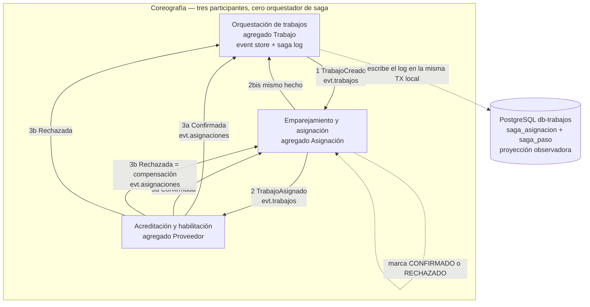

# Entrega 5 — Saga de asignación (coreografía)

Alcance recortado: almacenamiento y transacciones. No hay BFF, ni colección
Postman nueva, ni experimentos cuantitativos, ni refinamiento del mapa TO-BE.

La transacción larga es **asignar un proveedor habilitado a un trabajo ya
aceptado**. Cruza tres bounded contexts. Nadie dirige el flujo: cada servicio
reacciona a un evento y publica el siguiente hecho.

## Diagrama



Camino feliz:

```
CrearTrabajo → TrabajoCreado → TrabajoAsignado → AsignacionConfirmadaPorHabilitacion
estado saga: INICIADA → EN_CURSO → COMPLETADA
```

Camino de compensación (proyección de emparejamiento desfasada respecto del
dato autoritativo):

```
TrabajoAsignado (optimista)
    → AsignacionRechazadaPorHabilitacion
    → Emparejamiento marca RECHAZADO
    → Orquestación aplica ProveedorDescartado: Trabajo vuelve a CREADO
estado saga: EN_CURSO → COMPENSADA
```

## Dónde vive el saga log, y por qué

Se **adjunta a Orquestación de trabajos**, en las tablas `saga_asignacion` y
`saga_paso` de `db-trabajos`. No es un quinto microservicio.

| Opción | A favor | En contra |
|---|---|---|
| Servicio dedicado `saga-log` | Observador puro, DB aparte | Quinto contenedor, quinto Postgres, sin agregado. En un diagrama se confunde con un orquestador. |
| Adjuntarlo a Emparejamiento | Ve la asignación | No ve `TrabajoCreado` resuelto ni el event store del trabajo. |
| Adjuntarlo a Acreditación | Ve el veredicto autoritativo | No ve el inicio de la saga. |
| **Adjuntarlo a Orquestación** | El id de la saga **es** `trabajo_id`. Este servicio ya produce o consume los tres hitos. El log se escribe en la **misma transacción local** que el event store. | Mezcla una proyección operativa con el dueño de `Trabajo`. Se mitiga dejando el log como módulo de persistencia, sin comandos de salida. |

El log **no publica**. Si empezara a mandar `AsignarProveedor` dejaría de ser
coreografía. Ese comando ya existía como el único punto orquestado de
reintento acotado; Emparejamiento sigue sin consumirlo, a propósito.

## DDD solo donde corresponde

| Contexto | Agregado | Lo que aporta a la saga |
|---|---|---|
| Orquestación de trabajos | `Trabajo` | Acepta el trabajo, congela el SLA, deshace `ASIGNADO` al compensar. |
| Emparejamiento | `Asignacion` | Asigna contra proyección local; `CONFIRMADO` o `RECHAZADO`. |
| Acreditación | `Proveedor` | Dato autoritativo de habilitación. Confirma o dispara compensación. |

No se inventó un agregado "Saga". El log es infraestructura de monitoreo, no
un bounded context nuevo. Motor de reglas partner no participa: la regla ya
está proyectada cuando nace el trabajo.

## Cómo verlo con SQL

Con el stack arriba, `./scripts/demo_saga.sh` deja dos sagas. Después:

```bash
docker exec -it db-trabajos psql -U trabajos -d trabajos -f /dev/stdin < scripts/consulta_saga.sql
```

Consultas sueltas en `scripts/consulta_saga.sql`. HTTP de operador, no BFF:

```bash
curl -sS http://localhost:5001/sagas
curl -sS http://localhost:5001/sagas/<trabajo_id>
```
